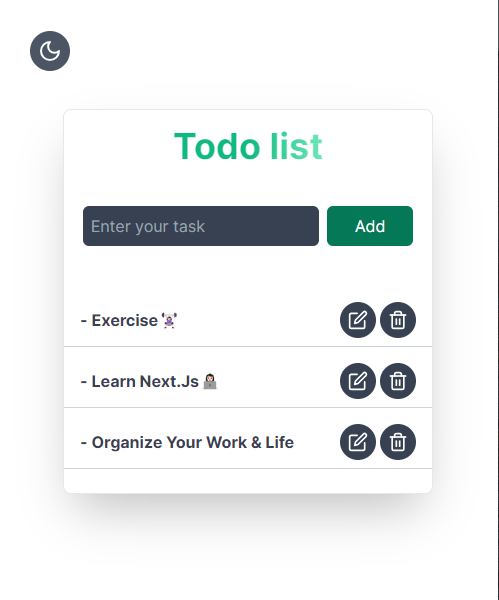
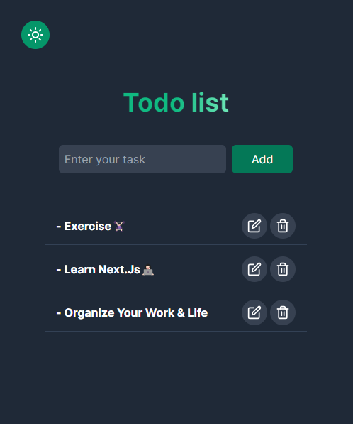

# Next.JS TodoList✍

  
  

### 
🔧Technologies:

  

  

 
 

You can visit and explore in the <a href="https://nextjs-todo-beige.vercel.app/" target="_blank">Next.JS Todo</a>.

--------------------------------------------------------------

  

📌Please Use VPN to see the project.

